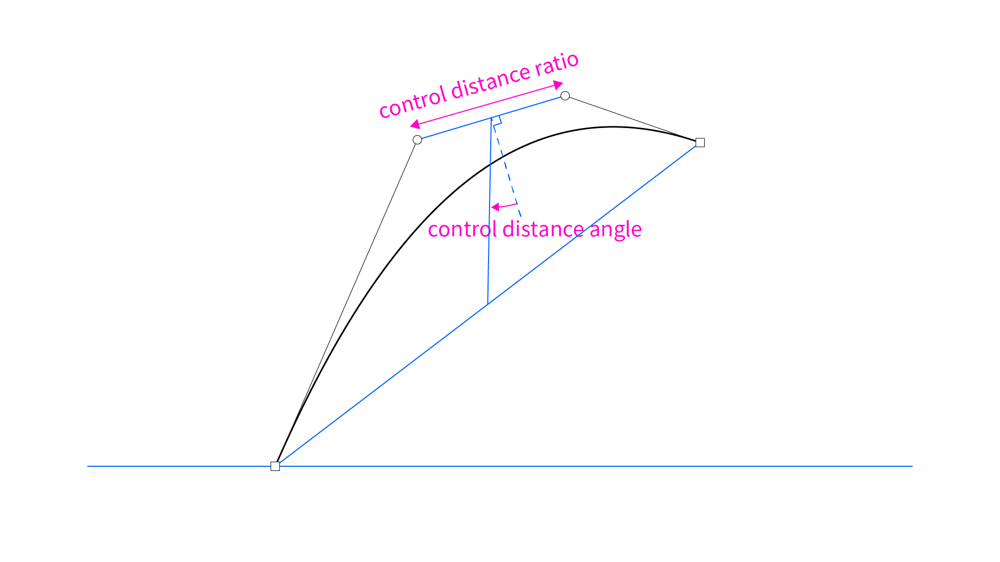

# @moyotsukai/bezier

A tool for drawing bezier curves.   
This library is for React projects in local environments.


# Quick Start

```
npm i @moyotsukai/bezier   
```   

```tsx
import Bezier from '@moyotsukai/bezier'

const App: React.FC = () => {
  const path = Bezier.spline({
    start: { x: 100, y: 400 },
    points: [
      {
        end: { eaa: 15, eal: 400 },
        controls: { sca: 30, scl: 100, eca: 45, ecl: 120 }
      }
    ]
  })

  return (
    <Bezier.Root>
      <Bezier.Svg
        splines={[path]}
      />
    </Bezier.Root>
  )
}

export default App
```


# Drawing Bezier Curves

A bezier curve consists of the following four points.


## Defining the Start Point

Give the coordinate to define the start point.

```tsx
const CENTER: Bezier.Vec2 = { x: 400, y: 300 }

const path = Bezier.spline({
    start: CENTER,
    ...
  })
```


## Defining the End Point

Option 1: Give the coordinate.

```tsx
const path = Bezier.spline({
    start: CENTER,
    points: [
      {
        end: { x: 600, y: 100 },
        ...
      }
    ]
  })
```


- - - 

Option 2: Define the end point using _end-anchor-angle_ (`eaa`) and _end-anchor-length_ (`eal`).

```tsx
const path = Bezier.spline({
    start: CENTER,
    points: [
      {
        end: { eaa: 35, eal: 300 },
        ...
      }
    ]
  })
```


## Defining Control Points

Option 1: Give the coordinate for _start-control_ (`sc`) and _end-control_ (`ec`).

```tsx
const path = Bezier.spline({
  start: CENTER,
  points: [
    {
      end: { eaa: 35, eal: 300 },
      controls: { sc: { x: 450, y: 120 }, ec: { x: 550, y: 90 } }
    }
  ]
})
```


- - - 

Option 2: Define the control points using _start-control-angle_ (`sca`), _start-control-length_ (`scl`), _end-control-angle_ (`eca`), and _end-control-length_ (`ecl`).

```tsx
const path = Bezier.spline({
  start: CENTER,
  points: [
    {
      end: { eaa: 35, eal: 300 },
      controls: { sca: 30, scl: 200, eca: 50, ecl: 100 }
    }
  ]
})
```


- - -

Option 3: Define the control points using _control-midpoint-angle_ (`cma`), _control-midpoint-length_ (`cml`), _ratio of control-distance to end-anchor-length_ (`cdr`), and _control-distance-angle_ (`cda`).

```tsx
const path = Bezier.spline({
  start: CENTER,
  points: [
    {
      end: { eaa: 35, eal: 800 * SCALE },
      controls: { cma: 30, cml: 120, cdr: 0.3, cda: -15 }
    }
  ]
})
```





# API Reference

## Bezier.Vec2

```ts
type Vec2 = {
  x: number
  y: number
}
```

## Bezier.Points

```ts
type Points = BezierPoints

type BezierPoints = {
  startAnchor: Vec2
  startControl: Vec2,
  endControl: Vec2,
  endAnchor: Vec2,
  anchorMidpoint: Vec2,
  controlMidpoint: Vec2
}
```

## Bezier.Spline

```ts
type Spline = BezierSpline

class BezierSpline {
    private _paths
    private _stroke
    private _fill

    constructor(paths: BezierPoints[], style?: BezierStyleProps)

    get paths(): BezierPoints[]
    get stroke(): string | null
    get fill(): string | null
    get startAnchor(): Vec2
    get endAnchor(): Vec2

    rotate({ center, angle }: {
        center: Vec2
        angle: number
    }): BezierSpline

    mirror({ center, angle }: {
        center: Vec2
        angle: number
    }): BezierSpline

    translate({ angle, distance }: {
        angle: number
        distance: number
    }): BezierSpline
}
```

## Bezier.spline()

```ts
function spline(props: ControlPointsProps, style?: StyleProps): BezierSpline
```

## Bezier.ControlPointsProps

```ts
type ControlPointsProps = BezierControlPointsProps

type BezierControlPointsProps = {
  start: Vec2,
  points: {
    end: EndPointAngleParameters | Vec2,
    controls: ControlPointsAngleParameters | ControlPointsMidpointParameters | ControlPointsVec2Parameters
  }[]
}

//eaa: end anchor angle
//eal: end anchor length
type EndPointAngleParameters = {
  eaa: number,
  eal: number
}

//sca: start control angle
//scl: start control length
//eca: end control angle
//ecl: end control length
type ControlPointsAngleParameters = {
  sca: number | "smooth"
  scl: number
  eca: number
  ecl: number
}

//cma: control midpoint angle
//cml: control midpoint length
//cdr: ratio of control distance to end anchor length
//cda: control distance angle
type ControlPointsMidpointParameters = {
  cma: number,
  cml: number,
  cdr: number | "smooth",
  cda: number
}

//sc: start control point
//ec: end control point
type ControlPointsVec2Parameters = {
  sc: Vec2,
  ec: Vec2
}
```

## Bezier.StyleProps

```ts
type StyleProps = BezierStyleProps

type BezierStyleProps = {
  stroke?: string | null
  fill?: string | null
}
```

## <Bezier.Root>

Props

```ts
{
  fileName?: string
  children: React.ReactNode
}
```

## <Bezier.Svg />

Props

```ts
{
  splines: BezierSpline[],
  width?: number,
  height?: number,
  expandCanvasToEdge?: boolean,
  shouGuide?: boolean
}
```

## Bezier.getStartAnchor()
```ts
function getStartAnchor(paths: BezierPoints[]): Vec2
```

## Bezier.getEndAnchor()
```ts
function getEndAnchor(paths: BezierPoints[]): Vec2
```

## Bezier.mirrorPath()
```ts
function mirrorPath({
  center: Vec2, 
  angle: number, 
  path: BezierPoints[]
}): BezierPoints[]
```

## Bezier.rotatePath()
```ts
function rotatePath({ 
  center: Vec2,
   angle: number,
   path: BezierPoints[]
}): BezierPoints[]
```

## Bezier.translatePath()
```ts
function translatePath({ 
  angle: number, 
  distance: number, 
  path: BezierPoints[]
}): BezierPoints[] 
```

## Bezier.absoluteAngle()
```ts
function absoluteAngle({
  start: Vec2,
  end: Vec2 
}): number
```

## Bezier.distance()
```ts
function distance(a: Vec2, b: Vec2): number
```

## Bezier.inferLine()
```ts
function inferLine({ 
  point: Vec2, 
  angle: number 
}): [Vec2, Vec2]
```

## Bezier.intersection()
```ts
function intersection(ab: [Vec2, Vec2], cd: [Vec2, Vec2]): Vec2 | null
```

## Bezier.midpoint()
```ts
function midpoint(a: Vec2, b: Vec2): Vec2
```


# Example

```tsx
import Bezier from '@moyotsukai/bezier'

const NUM = 8
const CENTER: Bezier.Vec2 = { x: 400, y: 300 }
const SCALE = 0.3

const Example: React.FC = () => {
  const path_1 = Bezier.spline({
    start: { x: CENTER.x + 5, y: CENTER.y - 25 },
    points: [
      {
        end: { eaa: 90, eal: 800 * SCALE },
        controls: { cma: -60, cml: -200 * SCALE, cdr: 0.3, cda: 60 }
      }
    ]
  }, {
    stroke: "red"
  })

  const path_2 = Bezier.spline({
    start: { x: CENTER.x - 5, y: CENTER.y - 25 },
    points: [
      {
        end: { eaa: 85, eal: 500 * SCALE },
        controls: { cma: -30, cml: -50 * SCALE, cdr: 0.5, cda: 30 }
      },
      {
        end: { eaa: 130, eal: 300 * SCALE },
        controls: { sca: "smooth", scl: 120 * SCALE, eca: -30, ecl: 80 * SCALE }
      }
    ]
  }, {
    stroke: "blue"
  })

  const path_3 = Bezier.spline({
    start: path_1.endAnchor,
    points: []
  })

  const splines: Bezier.Spline[] = Array(NUM).fill(0).map((_, index) => {
    return [
      path_1.rotate({ center: CENTER, angle: 360 / NUM * index }),
      path_2.rotate({ center: CENTER, angle: 360 / NUM * index })
    ]
  }).flat()

  return (
    <Bezier.Svg
      splines={splines}
      expandCanvasToEdge={true}
    />
  )
}

export default Example
```

